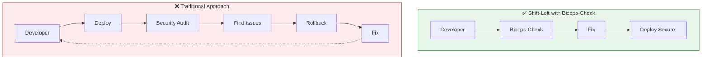
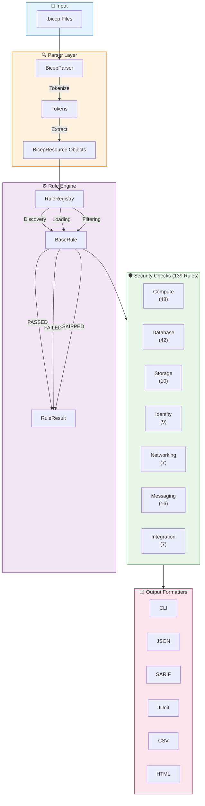
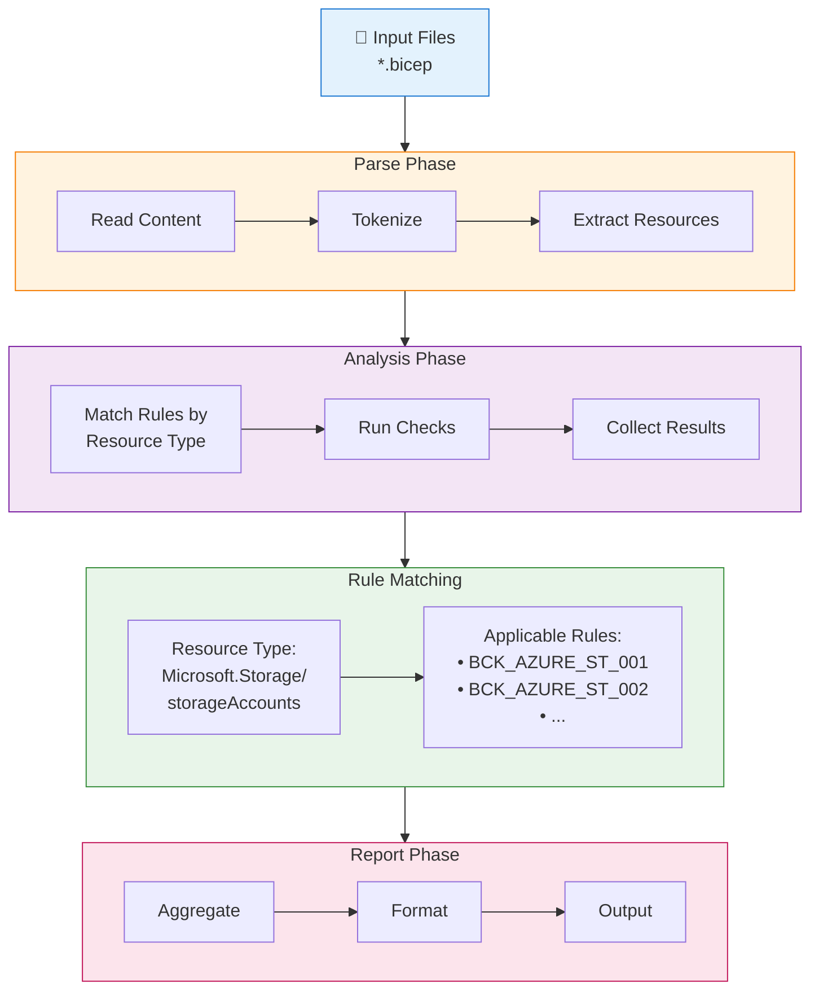
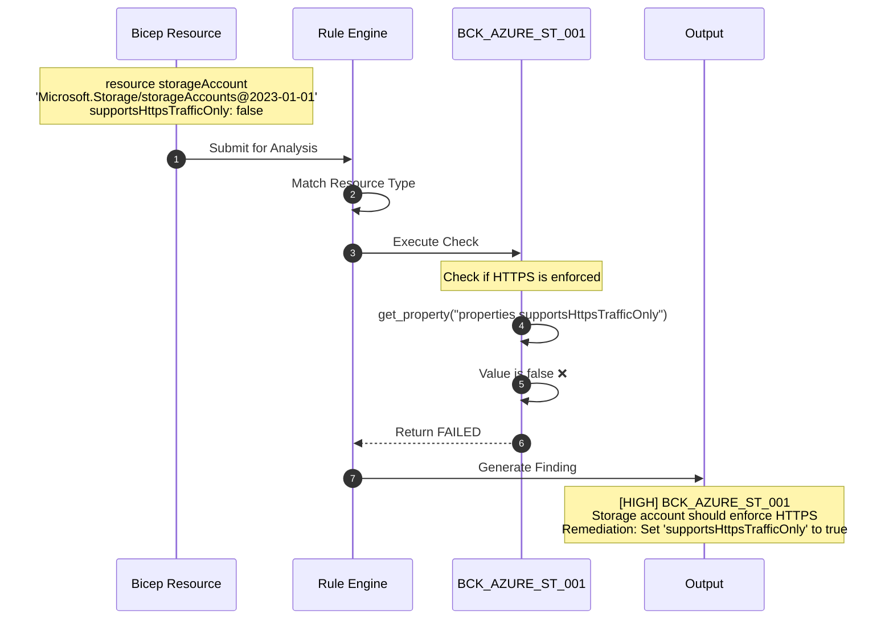
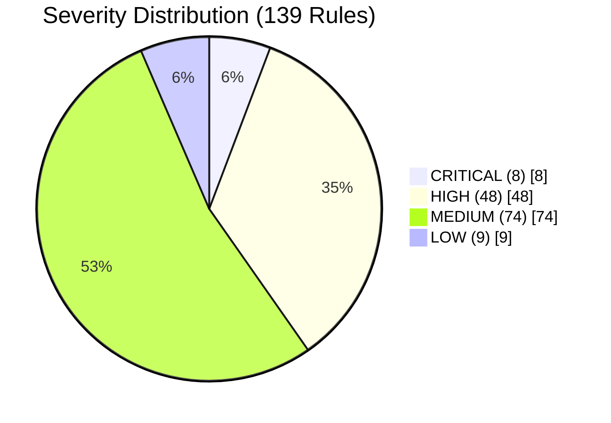
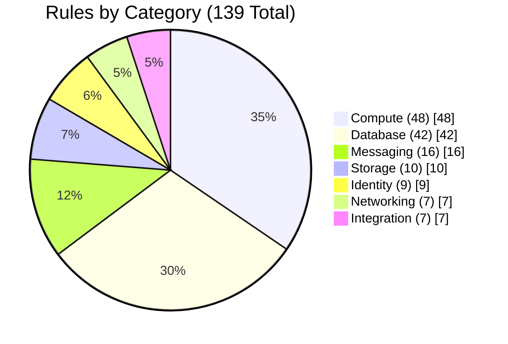
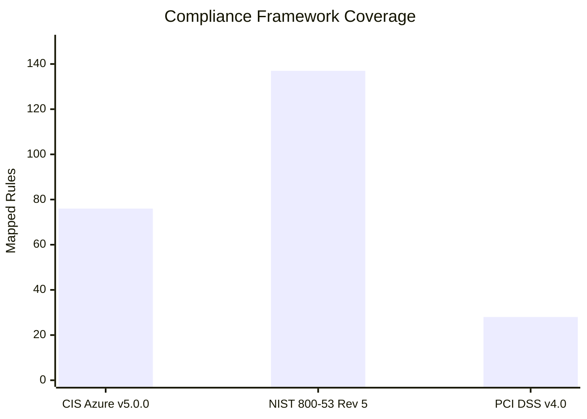
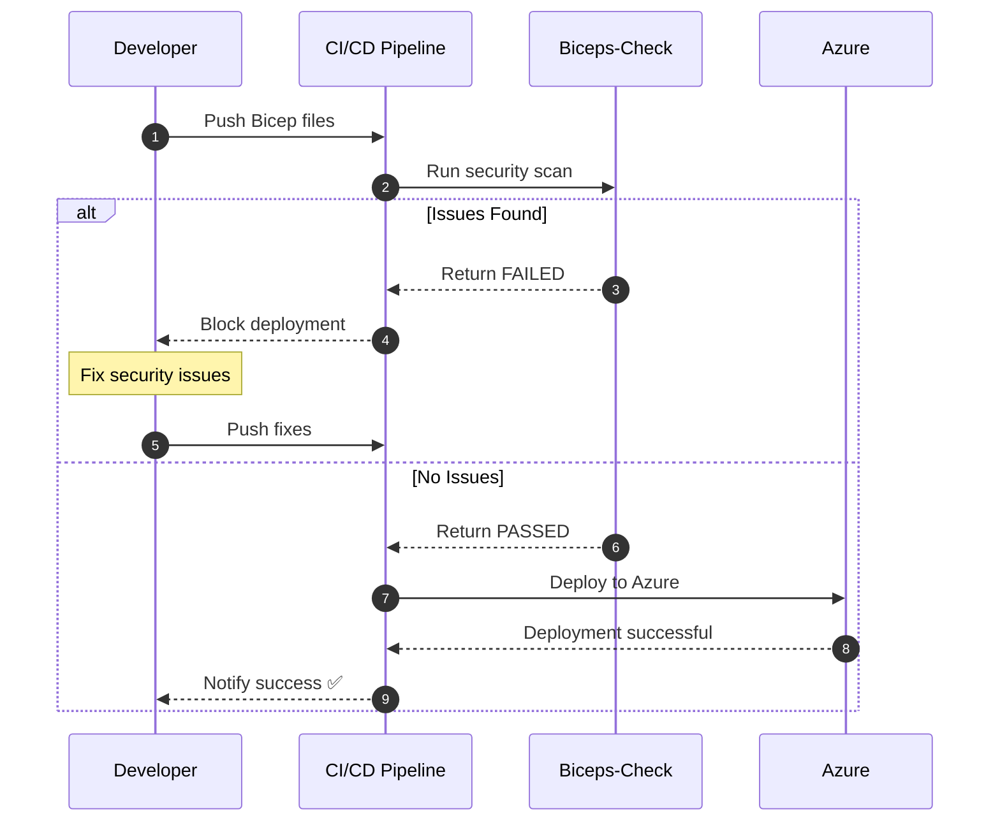
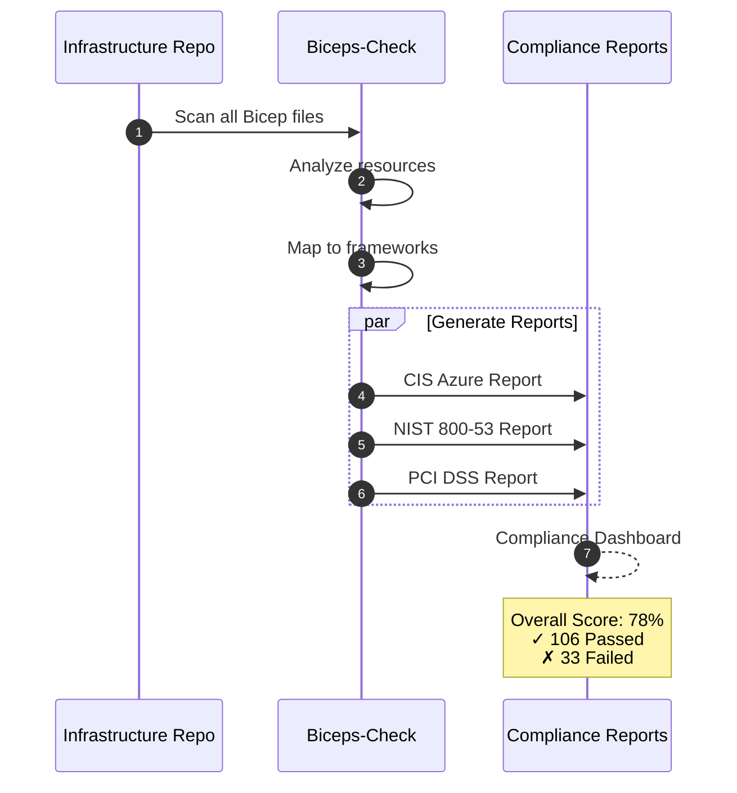
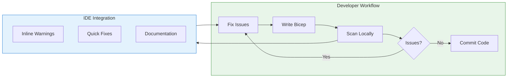

# Biceps-Check

[](https://opensource.org/licenses/MIT)
[](https://www.python.org/downloads/)
[](#rule-catalog)
[](#compliance-frameworks)

> **A comprehensive security scanning tool for Azure Bicep templates, inspired by Checkov.**

Biceps-Check analyzes your Azure Bicep infrastructure-as-code (IaC) files and detects security misconfigurations, compliance violations, and best practice deviations **before deployment** — shifting security left in your DevOps pipeline.

---

## Table of Contents

- [Overview](#overview)
- [Architecture](#architecture)
- [How It Works](#how-it-works)
- [Features](#features)
- [Installation](#installation)
- [Quick Start](#quick-start)
- [Rule Catalog](#rule-catalog)
- [Compliance Frameworks](#compliance-frameworks)
- [Use Cases](#use-cases)
- [CI/CD Integration](#cicd-integration)
- [Configuration](#configuration)
- [Custom Rules](#custom-rules)
- [API Reference](#api-reference)
- [Contributing](#contributing)
- [License](#license)

---

## Overview

### Why Biceps-Check?

Modern cloud infrastructure is defined as code, but security often becomes an afterthought. Biceps-Check addresses this by shifting security left:



### Key Benefits

| Benefit | Description |
|---------|-------------|
| **Early Detection** | Find security issues before they reach production |
| **Cost Reduction** | Fix issues when they're cheapest to address |
| **Compliance Automation** | Map to CIS, NIST, PCI DSS automatically |
| **Developer Experience** | Clear guidance and remediation steps |
| **CI/CD Native** | Integrates with your existing pipeline |

---

## Architecture

Biceps-Check follows a modular, extensible architecture inspired by Checkov:



### Component Responsibilities

| Component | Responsibility |
|-----------|---------------|
| **BicepParser** | Parses `.bicep` files and extracts resource definitions |
| **BicepResource** | Represents a single Azure resource with its properties |
| **RuleRegistry** | Discovers, loads, and manages all security rules |
| **BaseRule** | Abstract base class defining the rule interface |
| **Severity** | Enum: CRITICAL, HIGH, MEDIUM, LOW, INFO |
| **RuleResult** | Enum: PASSED, FAILED, SKIPPED |

---

## How It Works

### Scanning Flow



### Rule Evaluation Process



---

## Features

### Current Implementation Status

| Feature | Status | Description |
|---------|--------|-------------|
| Bicep Parsing | ✅ Complete | Full parsing of resources, parameters, variables |
| Rule Engine | ✅ Complete | Registry, filtering, severity levels |
| 139 Security Rules | ✅ Complete | Covering 7 categories |
| CIS Mapping | ✅ Complete | 76 rules mapped to CIS Azure |
| NIST 800-53 Mapping | ✅ Complete | 137 rules mapped |
| PCI DSS Mapping | ✅ Complete | 28 rules mapped |
| CLI Output | ✅ Complete | Human-readable results |
| JSON Output | 🔄 Planned | Machine-readable results |
| SARIF Output | 🔄 Planned | GitHub Security integration |
| CI/CD Actions | 🔄 Planned | GitHub Actions, Azure DevOps |
| Custom Rules | 🔄 Planned | User-defined rules |
| Auto-Remediation | 🔄 Planned | Fix suggestions |

### Severity Distribution



**Severity Definitions:**

| Severity | Description |
|----------|-------------|
| **CRITICAL** | Immediate security risk, must fix before deployment |
| **HIGH** | Significant security risk, fix as soon as possible |
| **MEDIUM** | Moderate security risk, fix in regular maintenance |
| **LOW** | Minor security concern or best practice deviation |

---

## Installation

### Prerequisites

- Python 3.10 or higher
- pip or pipx

### Install from Source

```bash
# Clone the repository
git clone https://github.com/your-org/biceps-check.git
cd biceps-check

# Create virtual environment
python -m venv venv
source venv/bin/activate  # Linux/macOS
# or
.\venv\Scripts\activate  # Windows

# Install in development mode
pip install -e ".[dev]"

# Verify installation
python -c "from biceps_check.rules.registry import RuleRegistry; r = RuleRegistry(); r.load_all_rules(); print(f'Loaded {r.count} rules')"
```

### Development Dependencies

```bash
# Install all development tools
pip install -e ".[dev]"

# Tools included:
# - pytest: Testing framework
# - ruff: Fast Python linter and formatter
# - ty: Fast Python type checker (Astral)
# - structlog: Structured logging
```

---

## Quick Start

### Programmatic Usage

```python
from pathlib import Path
from biceps_check.parser.bicep_parser import BicepParser
from biceps_check.rules.registry import RuleRegistry
from biceps_check.rules.base import RuleResult

# Initialize components
parser = BicepParser()
registry = RuleRegistry()
registry.load_all_rules()

# Parse a Bicep file
bicep_file = parser.parse_file(Path("infrastructure/main.bicep"))

# Run security checks
for resource in bicep_file.resources:
    # Get applicable rules for this resource type
    rules = registry.get_rules_for_resource(resource.resource_type)

    for rule in rules:
        result = rule.check(resource)

        if result == RuleResult.FAILED:
            print(f"[{rule.severity.name}] {rule.id}: {rule.name}")
            print(f"  Resource: {resource.name}")
            print(f"  Remediation: {rule.remediation}")
            print()
```

### Example Output

```
Scanning: examples/non_compliant/storage_account.bicep

[HIGH] BCK_AZURE_ST_001: Storage account should enforce HTTPS
  Resource: storageAccount
  Remediation: Set 'supportsHttpsTrafficOnly' to true

[HIGH] BCK_AZURE_ST_002: Storage account should use minimum TLS 1.2
  Resource: storageAccount
  Remediation: Set 'minimumTlsVersion' to 'TLS1_2'

[MEDIUM] BCK_AZURE_ST_004: Storage account should deny public blob access
  Resource: storageAccount
  Remediation: Set 'allowBlobPublicAccess' to false

Summary: 3 passed, 7 failed
```

---

## Rule Catalog

### Rules by Category



| Category | Rules | Azure Resources Covered |
|----------|-------|-------------------------|
| **Compute** | 48 | VMs, AKS, ACR, App Service, Functions |
| **Database** | 42 | SQL, Cosmos DB, MySQL, PostgreSQL, Redis |
| **Messaging** | 16 | Service Bus, Event Hub |
| **Storage** | 10 | Storage Accounts |
| **Identity** | 9 | Key Vault |
| **Networking** | 7 | NSGs |
| **Integration** | 7 | Data Factory |

### Complete Rule List

<details>
<summary><strong>Compute Rules (48 rules)</strong></summary>

#### Virtual Machines (10 rules)
| Rule ID | Name | Severity |
|---------|------|----------|
| BCK_AZURE_VM_001 | VM should have managed disks with encryption enabled | HIGH |
| BCK_AZURE_VM_002 | VM should not have public IP directly attached | HIGH |
| BCK_AZURE_VM_003 | VM should use managed identity | MEDIUM |
| BCK_AZURE_VM_004 | VM should have boot diagnostics enabled | MEDIUM |
| BCK_AZURE_VM_005 | VM should have automatic OS updates enabled | MEDIUM |
| BCK_AZURE_VM_006 | VM should have secure boot enabled | HIGH |
| BCK_AZURE_VM_007 | VM should have vTPM enabled | HIGH |
| BCK_AZURE_VM_008 | VM should have endpoint protection configured | HIGH |
| BCK_AZURE_VM_009 | VM should not use simple admin credentials | CRITICAL |
| BCK_AZURE_VM_010 | VM should have guest agent enabled | LOW |

#### Azure Kubernetes Service (10 rules)
| Rule ID | Name | Severity |
|---------|------|----------|
| BCK_AZURE_AKS_001 | AKS should have RBAC enabled | HIGH |
| BCK_AZURE_AKS_002 | AKS should have network policy enabled | MEDIUM |
| BCK_AZURE_AKS_003 | AKS should have private cluster enabled | HIGH |
| BCK_AZURE_AKS_004 | AKS should use managed identity | MEDIUM |
| BCK_AZURE_AKS_005 | AKS should have Azure AD integration enabled | MEDIUM |
| BCK_AZURE_AKS_006 | AKS should have API server authorized IP ranges | HIGH |
| BCK_AZURE_AKS_007 | AKS should have Defender profile enabled | MEDIUM |
| BCK_AZURE_AKS_008 | AKS should disable local accounts | MEDIUM |
| BCK_AZURE_AKS_009 | AKS should have Azure Policy add-on enabled | MEDIUM |
| BCK_AZURE_AKS_010 | AKS should have HTTP application routing disabled | MEDIUM |

#### Container Registry (10 rules)
| Rule ID | Name | Severity |
|---------|------|----------|
| BCK_AZURE_ACR_001 | ACR should have admin user disabled | HIGH |
| BCK_AZURE_ACR_002 | ACR should use private endpoints | HIGH |
| BCK_AZURE_ACR_003 | ACR should have content trust enabled | MEDIUM |
| BCK_AZURE_ACR_004 | ACR should have public network access disabled | HIGH |
| BCK_AZURE_ACR_005 | ACR should use Premium SKU for security features | MEDIUM |
| BCK_AZURE_ACR_006 | ACR should have retention policy enabled | MEDIUM |
| BCK_AZURE_ACR_007 | ACR should have vulnerability scanning enabled | HIGH |
| BCK_AZURE_ACR_008 | ACR should use zone redundancy | MEDIUM |
| BCK_AZURE_ACR_009 | ACR should have export policy disabled | MEDIUM |
| BCK_AZURE_ACR_010 | ACR should have anonymous pull disabled | HIGH |

#### App Service (10 rules)
| Rule ID | Name | Severity |
|---------|------|----------|
| BCK_AZURE_APP_001 | App Service should use HTTPS only | HIGH |
| BCK_AZURE_APP_002 | App Service should use minimum TLS 1.2 | HIGH |
| BCK_AZURE_APP_003 | App Service should use managed identity | MEDIUM |
| BCK_AZURE_APP_004 | App Service should disable FTP | MEDIUM |
| BCK_AZURE_APP_005 | App Service should have authentication enabled | MEDIUM |
| BCK_AZURE_APP_006 | App Service should have remote debugging disabled | HIGH |
| BCK_AZURE_APP_007 | App Service should have client certificates enabled | MEDIUM |
| BCK_AZURE_APP_008 | App Service should use VNet integration | MEDIUM |
| BCK_AZURE_APP_009 | App Service should have diagnostic logs enabled | MEDIUM |
| BCK_AZURE_APP_010 | App Service should use latest runtime version | LOW |

#### Azure Functions (8 rules)
| Rule ID | Name | Severity |
|---------|------|----------|
| BCK_AZURE_FUNC_001 | Function App should use HTTPS only | HIGH |
| BCK_AZURE_FUNC_002 | Function App should use managed identity | MEDIUM |
| BCK_AZURE_FUNC_003 | Function App should have authentication enabled | MEDIUM |
| BCK_AZURE_FUNC_004 | Function App should use latest runtime version | LOW |
| BCK_AZURE_FUNC_005 | Function App should have Application Insights enabled | MEDIUM |
| BCK_AZURE_FUNC_006 | Function App should use private endpoints | HIGH |
| BCK_AZURE_FUNC_007 | Function App should disable public network access | HIGH |
| BCK_AZURE_FUNC_008 | Function App should use minimum TLS 1.2 | HIGH |

</details>

<details>
<summary><strong>Database Rules (42 rules)</strong></summary>

#### SQL Server (7 rules)
| Rule ID | Name | Severity |
|---------|------|----------|
| BCK_AZURE_SQL_001 | SQL Server should have Azure AD admin configured | HIGH |
| BCK_AZURE_SQL_002 | SQL Server should have auditing enabled | HIGH |
| BCK_AZURE_SQL_003 | SQL Server should have threat detection enabled | HIGH |
| BCK_AZURE_SQL_004 | SQL Server should have minimum TLS 1.2 | HIGH |
| BCK_AZURE_SQL_005 | SQL Server should deny public network access | HIGH |
| BCK_AZURE_SQL_006 | SQL Server should use Azure AD-only authentication | MEDIUM |
| BCK_AZURE_SQL_007 | SQL Server should have vulnerability assessment enabled | MEDIUM |

#### Cosmos DB (7 rules)
| Rule ID | Name | Severity |
|---------|------|----------|
| BCK_AZURE_COSMOS_001 | Cosmos DB should have firewall rules configured | HIGH |
| BCK_AZURE_COSMOS_002 | Cosmos DB should disable public network access | HIGH |
| BCK_AZURE_COSMOS_003 | Cosmos DB should have automatic failover enabled | MEDIUM |
| BCK_AZURE_COSMOS_004 | Cosmos DB should have local authentication disabled | MEDIUM |
| BCK_AZURE_COSMOS_005 | Cosmos DB should have continuous backup enabled | MEDIUM |
| BCK_AZURE_COSMOS_006 | Cosmos DB should have diagnostic logs enabled | MEDIUM |
| BCK_AZURE_COSMOS_007 | Cosmos DB should have virtual network rules | MEDIUM |

#### MySQL (8 rules)
| Rule ID | Name | Severity |
|---------|------|----------|
| BCK_AZURE_MYSQL_001 | MySQL should disable public network access | HIGH |
| BCK_AZURE_MYSQL_002 | MySQL should use private endpoints | MEDIUM |
| BCK_AZURE_MYSQL_003 | MySQL should use Microsoft Entra authentication only | MEDIUM |
| BCK_AZURE_MYSQL_004 | MySQL should use minimum TLS 1.2 | HIGH |
| BCK_AZURE_MYSQL_005 | MySQL should require SSL connections | HIGH |
| BCK_AZURE_MYSQL_006 | MySQL should have audit logging enabled | MEDIUM |
| BCK_AZURE_MYSQL_007 | MySQL should have geo-redundant backup enabled | MEDIUM |
| BCK_AZURE_MYSQL_008 | MySQL should have high availability configured | MEDIUM |

#### PostgreSQL (10 rules)
| Rule ID | Name | Severity |
|---------|------|----------|
| BCK_AZURE_PSQL_001 | PostgreSQL should disable public network access | HIGH |
| BCK_AZURE_PSQL_002 | PostgreSQL should use private endpoints | MEDIUM |
| BCK_AZURE_PSQL_003 | PostgreSQL should use Microsoft Entra authentication only | MEDIUM |
| BCK_AZURE_PSQL_004 | PostgreSQL should use minimum TLS 1.2 | HIGH |
| BCK_AZURE_PSQL_005 | PostgreSQL should require SSL connections | HIGH |
| BCK_AZURE_PSQL_006 | PostgreSQL should have connection logging enabled | MEDIUM |
| BCK_AZURE_PSQL_007 | PostgreSQL should have disconnection logging enabled | MEDIUM |
| BCK_AZURE_PSQL_008 | PostgreSQL should have checkpoint logging enabled | LOW |
| BCK_AZURE_PSQL_009 | PostgreSQL should have connection throttling enabled | MEDIUM |
| BCK_AZURE_PSQL_010 | PostgreSQL should have geo-redundant backup enabled | MEDIUM |

#### Redis Cache (10 rules)
| Rule ID | Name | Severity |
|---------|------|----------|
| BCK_AZURE_REDIS_001 | Redis should have TLS enabled | HIGH |
| BCK_AZURE_REDIS_002 | Redis should have firewall rules configured | HIGH |
| BCK_AZURE_REDIS_003 | Redis should use private endpoints | HIGH |
| BCK_AZURE_REDIS_004 | Redis should have non-SSL port disabled | HIGH |
| BCK_AZURE_REDIS_005 | Redis should use minimum TLS 1.2 | HIGH |
| BCK_AZURE_REDIS_006 | Redis should have authentication enabled | CRITICAL |
| BCK_AZURE_REDIS_007 | Redis should have data persistence enabled | MEDIUM |
| BCK_AZURE_REDIS_008 | Redis should have patching schedule configured | LOW |
| BCK_AZURE_REDIS_009 | Redis should use Premium tier for production | LOW |
| BCK_AZURE_REDIS_010 | Redis should have zone redundancy enabled | MEDIUM |

</details>

<details>
<summary><strong>Storage Rules (10 rules)</strong></summary>

| Rule ID | Name | Severity |
|---------|------|----------|
| BCK_AZURE_ST_001 | Storage account should enforce HTTPS | HIGH |
| BCK_AZURE_ST_002 | Storage account should use minimum TLS 1.2 | HIGH |
| BCK_AZURE_ST_003 | Storage account should have secure transfer enabled | HIGH |
| BCK_AZURE_ST_004 | Storage account should deny public blob access | MEDIUM |
| BCK_AZURE_ST_005 | Storage account should have network rules configured | HIGH |
| BCK_AZURE_ST_006 | Storage account should have blob soft delete enabled | MEDIUM |
| BCK_AZURE_ST_007 | Storage account should have container soft delete enabled | MEDIUM |
| BCK_AZURE_ST_008 | Storage account should have infrastructure encryption | MEDIUM |
| BCK_AZURE_ST_009 | Storage account should disable shared key access | MEDIUM |
| BCK_AZURE_ST_010 | Storage account should have Azure Defender enabled | MEDIUM |

</details>

<details>
<summary><strong>Identity Rules (9 rules)</strong></summary>

#### Key Vault (9 rules)
| Rule ID | Name | Severity |
|---------|------|----------|
| BCK_AZURE_KV_001 | Key Vault should have purge protection enabled | CRITICAL |
| BCK_AZURE_KV_002 | Key Vault should have soft delete enabled | HIGH |
| BCK_AZURE_KV_003 | Key Vault should use RBAC for access control | MEDIUM |
| BCK_AZURE_KV_004 | Key Vault should have firewall rules configured | HIGH |
| BCK_AZURE_KV_005 | Key Vault should use private endpoints | HIGH |
| BCK_AZURE_KV_006 | Key Vault should have diagnostic logs enabled | MEDIUM |
| BCK_AZURE_KV_007 | Key Vault secrets should have expiration dates | MEDIUM |
| BCK_AZURE_KV_008 | Key Vault keys should have expiration dates | MEDIUM |
| BCK_AZURE_KV_009 | Key Vault keys should use RSA or EC with appropriate size | MEDIUM |

</details>

<details>
<summary><strong>Networking Rules (7 rules)</strong></summary>

#### Network Security Groups (7 rules)
| Rule ID | Name | Severity |
|---------|------|----------|
| BCK_AZURE_NSG_001 | NSG should not allow inbound SSH from any source | CRITICAL |
| BCK_AZURE_NSG_002 | NSG should not allow inbound RDP from any source | CRITICAL |
| BCK_AZURE_NSG_003 | NSG should not allow inbound from any source on all ports | CRITICAL |
| BCK_AZURE_NSG_004 | NSG should have flow logs enabled | MEDIUM |
| BCK_AZURE_NSG_005 | NSG should restrict database ports from internet | HIGH |
| BCK_AZURE_NSG_006 | NSG rules should have descriptions | LOW |
| BCK_AZURE_NSG_007 | NSG should have explicit default deny inbound rule | MEDIUM |

</details>

<details>
<summary><strong>Messaging Rules (16 rules)</strong></summary>

#### Service Bus (8 rules)
| Rule ID | Name | Severity |
|---------|------|----------|
| BCK_AZURE_SB_001 | Service Bus should use Premium tier for production | MEDIUM |
| BCK_AZURE_SB_002 | Service Bus should have firewall rules configured | HIGH |
| BCK_AZURE_SB_003 | Service Bus should use private endpoints | HIGH |
| BCK_AZURE_SB_004 | Service Bus should disable public network access | HIGH |
| BCK_AZURE_SB_005 | Service Bus should use minimum TLS 1.2 | HIGH |
| BCK_AZURE_SB_006 | Service Bus should disable local authentication | MEDIUM |
| BCK_AZURE_SB_007 | Service Bus should have diagnostic logs enabled | MEDIUM |
| BCK_AZURE_SB_008 | Service Bus should have zone redundancy enabled | MEDIUM |

#### Event Hub (8 rules)
| Rule ID | Name | Severity |
|---------|------|----------|
| BCK_AZURE_EH_001 | Event Hub should have firewall rules configured | HIGH |
| BCK_AZURE_EH_002 | Event Hub should use private endpoints | HIGH |
| BCK_AZURE_EH_003 | Event Hub should disable public network access | HIGH |
| BCK_AZURE_EH_004 | Event Hub should use minimum TLS 1.2 | HIGH |
| BCK_AZURE_EH_005 | Event Hub should disable local authentication | MEDIUM |
| BCK_AZURE_EH_006 | Event Hub should have auto-inflate enabled | LOW |
| BCK_AZURE_EH_007 | Event Hub should have zone redundancy enabled | MEDIUM |
| BCK_AZURE_EH_008 | Event Hub should have capture enabled for data retention | LOW |

</details>

<details>
<summary><strong>Integration Rules (7 rules)</strong></summary>

#### Data Factory (7 rules)
| Rule ID | Name | Severity |
|---------|------|----------|
| BCK_AZURE_ADF_001 | Data Factory should use managed identity | HIGH |
| BCK_AZURE_ADF_002 | Data Factory should disable public network access | HIGH |
| BCK_AZURE_ADF_003 | Data Factory should use private endpoints | MEDIUM |
| BCK_AZURE_ADF_004 | Data Factory should use customer-managed keys | MEDIUM |
| BCK_AZURE_ADF_005 | Data Factory should have Git integration enabled | LOW |
| BCK_AZURE_ADF_006 | Data Factory should have diagnostic logs enabled | MEDIUM |
| BCK_AZURE_ADF_007 | Data Factory Self-Hosted IR should be securely configured | MEDIUM |

</details>

---

## Compliance Frameworks

Biceps-Check maps security rules to industry compliance frameworks for audit and governance purposes.

### Framework Coverage



| Framework | Mapped Rules | Coverage |
|-----------|--------------|----------|
| **CIS Azure v5.0.0** | 76 | 55% of rules |
| **NIST 800-53 Rev 5** | 137 | 99% of rules |
| **PCI DSS v4.0** | 28 | 20% of rules |

### CIS Azure Foundations Benchmark Mapping

The following CIS Azure Foundations Benchmark v5.0.0 controls are covered:

| CIS Section | Control Area | Mapped Rules |
|-------------|--------------|--------------|
| 4.x | Database Services | 25 rules |
| 5.x | Logging and Monitoring | 12 rules |
| 6.x | Networking | 15 rules |
| 7.x | Virtual Machines | 10 rules |
| 8.x | Key Vault | 9 rules |
| 9.x | App Service | 5 rules |

### NIST 800-53 Control Families

| Control Family | Description | Mapped Rules |
|----------------|-------------|--------------|
| AC (Access Control) | Access restrictions and permissions | 32 |
| AU (Audit) | Logging and audit trails | 18 |
| CM (Configuration Management) | Secure configuration | 20 |
| CP (Contingency Planning) | Backup and recovery | 8 |
| IA (Identification & Authentication) | Identity verification | 14 |
| SC (System Communications) | Network and data protection | 45 |

---

## Use Cases

### Use Case 1: Pre-Deployment Security Gate



**Implementation:**

```yaml
# .github/workflows/security-scan.yml
name: Biceps-Check Security Scan

on: [push, pull_request]

jobs:
  security-scan:
    runs-on: ubuntu-latest
    steps:
      - uses: actions/checkout@v4

      - name: Setup Python
        uses: actions/setup-python@v5
        with:
          python-version: '3.10'

      - name: Install Biceps-Check
        run: pip install biceps-check

      - name: Run Security Scan
        run: |
          biceps-check scan ./infrastructure \
            --min-severity HIGH \
            --output sarif \
            --output-file results.sarif

      - name: Upload SARIF
        uses: github/codeql-action/upload-sarif@v3
        with:
          sarif_file: results.sarif
```

### Use Case 2: Compliance Audit Report



**Example Output:**

```
═══════════════════════════════════════════════════════════════════════════════
                        CIS AZURE COMPLIANCE REPORT
═══════════════════════════════════════════════════════════════════════════════

  Organization: Contoso Corp
  Date: 2026-02-04
  Scope: infrastructure/**/*.bicep

  OVERALL COMPLIANCE SCORE: 78%

  Section 4: Database Services
    ✓ 4.1.1 SQL Server auditing enabled          [PASSED]
    ✓ 4.1.2 SQL Server TLS 1.2                   [PASSED]
    ✗ 4.2.1 PostgreSQL public access disabled    [FAILED]
    ✓ 4.2.2 PostgreSQL SSL enforcement           [PASSED]

  Section 6: Networking
    ✗ 6.1 NSG SSH restriction                    [FAILED]
    ✗ 6.2 NSG RDP restriction                    [FAILED]
    ✓ 6.3 NSG flow logs enabled                  [PASSED]

═══════════════════════════════════════════════════════════════════════════════
```

### Use Case 3: Developer Feedback Loop



---

## CI/CD Integration

### GitHub Actions

```yaml
name: Infrastructure Security

on:
  push:
    paths:
      - '**/*.bicep'
  pull_request:
    paths:
      - '**/*.bicep'

jobs:
  biceps-check:
    runs-on: ubuntu-latest

    steps:
      - name: Checkout
        uses: actions/checkout@v4

      - name: Setup Python
        uses: actions/setup-python@v5
        with:
          python-version: '3.10'

      - name: Install Dependencies
        run: pip install biceps-check

      - name: Run Biceps-Check
        run: |
          biceps-check scan . \
            --min-severity MEDIUM \
            --output json \
            --output-file results.json

      - name: Check Results
        run: |
          FAILED=$(jq '.summary.failed' results.json)
          if [ "$FAILED" -gt 0 ]; then
            echo "::error::$FAILED security issues found"
            exit 1
          fi
```

### Azure DevOps

```yaml
trigger:
  paths:
    include:
      - '**/*.bicep'

pool:
  vmImage: 'ubuntu-latest'

steps:
  - task: UsePythonVersion@0
    inputs:
      versionSpec: '3.10'

  - script: pip install biceps-check
    displayName: 'Install Biceps-Check'

  - script: |
      biceps-check scan $(Build.SourcesDirectory) \
        --output junit \
        --output-file $(Build.ArtifactStagingDirectory)/results.xml
    displayName: 'Run Security Scan'

  - task: PublishTestResults@2
    inputs:
      testResultsFormat: 'JUnit'
      testResultsFiles: '$(Build.ArtifactStagingDirectory)/results.xml'
      testRunTitle: 'Biceps-Check Security Scan'
```

### GitLab CI

```yaml
biceps-check:
  image: python:3.10
  stage: test

  before_script:
    - pip install biceps-check

  script:
    - biceps-check scan . --output json --output-file report.json
    - |
      CRITICAL=$(jq '.summary.by_severity.CRITICAL // 0' report.json)
      if [ "$CRITICAL" -gt 0 ]; then
        echo "Critical security issues found!"
        exit 1
      fi

  artifacts:
    reports:
      codequality: report.json
    paths:
      - report.json
```

---

## Configuration

### Configuration File

Create `.biceps-check.yaml` in your project root:

```yaml
# Biceps-Check Configuration
# Version: 1.0

# Scanning options
scan:
  # Directories/files to scan
  include:
    - "infrastructure/**/*.bicep"
    - "modules/**/*.bicep"

  # Patterns to exclude
  exclude:
    - "**/examples/**"
    - "**/test/**"

# Rule configuration
rules:
  # Minimum severity to report (CRITICAL, HIGH, MEDIUM, LOW, INFO)
  min_severity: LOW

  # Enable all rules by default
  enable_all: true

  # Specific rules to skip
  skip:
    - BCK_AZURE_VM_002  # Allow public IPs for bastion hosts

  # Or enable only specific rules
  # enable_only:
  #   - BCK_AZURE_ST_001
  #   - BCK_AZURE_KV_001

# Suppressions (inline or config-based)
suppressions:
  - rule: BCK_AZURE_ST_001
    resource: "legacyStorageAccount"
    reason: "Legacy system - migration planned for Q3"
    expires: "2026-09-30"

# Output configuration
output:
  format: cli  # cli, json, sarif, junit, csv, html
  file: null   # Output file path (null = stdout)

  # Include in output
  include_passed: false
  include_skipped: false

# Compliance reporting
compliance:
  # Generate reports for these frameworks
  frameworks:
    - cis-azure
    - nist-800-53
    - pci-dss
```

### Environment Variables

| Variable | Description | Default |
|----------|-------------|---------|
| `BICEPS_CHECK_CONFIG` | Path to configuration file | `.biceps-check.yaml` |
| `BICEPS_CHECK_MIN_SEVERITY` | Minimum severity level | `LOW` |
| `BICEPS_CHECK_OUTPUT_FORMAT` | Output format | `cli` |
| `BICEPS_CHECK_FAIL_ON` | Severity level that causes exit code 1 | `HIGH` |

---

## Custom Rules

### Creating a Custom Rule

```python
# custom_rules/naming_convention.py
from biceps_check.rules.base import BaseRule, RuleResult, Severity
from biceps_check.parser.models import BicepResource


class StorageNamingConvention(BaseRule):
    """Enforce storage account naming convention."""

    # Rule metadata
    id = "BCK_CUSTOM_001"
    name = "Storage account should follow naming convention"
    description = (
        "Storage account names should start with 'st' followed by "
        "environment and purpose identifiers."
    )
    severity = Severity.MEDIUM
    resource_types = ["Microsoft.Storage/storageAccounts"]
    category = "naming"

    # Remediation guidance
    remediation = (
        "Rename storage account to follow pattern: "
        "st<env><purpose><random> (e.g., stproddata1234)"
    )

    # Compliance mapping (optional)
    # cis_azure = ["custom"]
    # nist_800_53 = ["CM-2"]

    def check(self, resource: BicepResource) -> RuleResult:
        """Check if storage account follows naming convention."""
        name = resource.get_property("name", "")

        # Handle parameter references
        if name.startswith("[") or not name:
            return RuleResult.SKIPPED

        # Check naming pattern
        if not name.startswith("st"):
            return RuleResult.FAILED

        return RuleResult.PASSED
```

### Loading Custom Rules

```python
from pathlib import Path
from biceps_check.rules.registry import RuleRegistry

registry = RuleRegistry()
registry.load_all_rules()  # Load built-in rules
registry.load_custom_rules(Path("./custom_rules"))  # Load custom rules

print(f"Total rules: {registry.count}")
```

---

## API Reference

### Core Classes

#### BicepParser

```python
from biceps_check.parser.bicep_parser import BicepParser

parser = BicepParser()

# Parse a single file
bicep_file = parser.parse_file(Path("main.bicep"))

# Access parsed data
for resource in bicep_file.resources:
    print(f"Resource: {resource.name}")
    print(f"Type: {resource.resource_type}")
    print(f"Properties: {resource.properties}")
```

#### RuleRegistry

```python
from biceps_check.rules.registry import RuleRegistry

registry = RuleRegistry()
registry.load_all_rules()

# Get all rules
all_rules = registry.get_rules(enabled_only=True)

# Filter by category
storage_rules = registry.get_rules(category="storage")

# Filter by severity
critical_rules = registry.get_rules(severity=Severity.CRITICAL)

# Get rules for specific resource type
rules = registry.get_rules_for_resource("Microsoft.Storage/storageAccounts")

# Get statistics
stats = registry.get_statistics()
print(f"Total: {stats['total']}")
print(f"By category: {stats['by_category']}")
```

#### BaseRule

```python
from biceps_check.rules.base import BaseRule, RuleResult, Severity

class MyRule(BaseRule):
    id = "BCK_MY_001"
    name = "My custom rule"
    description = "Detailed description"
    severity = Severity.HIGH
    resource_types = ["Microsoft.Storage/storageAccounts"]
    category = "custom"
    remediation = "How to fix"
    references = ["https://docs.example.com"]

    # Optional compliance mapping
    cis_azure = ["1.1"]
    nist_800_53 = ["AC-1"]
    pci_dss = ["1.1.1"]

    def check(self, resource: BicepResource) -> RuleResult:
        # Implement check logic
        return RuleResult.PASSED
```

---

## Contributing

We welcome contributions! Here's how to get started:

### Development Setup

```bash
# Clone the repository
git clone https://github.com/your-org/biceps-check.git
cd biceps-check

# Create virtual environment
python -m venv venv
source venv/bin/activate

# Install development dependencies
pip install -e ".[dev]"

# Run tests
pytest tests/ -v

# Run type checking
ty check src/biceps_check/

# Run linting
ruff check src/biceps_check/
```

### Adding New Rules

1. Create a new file in the appropriate category under `src/biceps_check/checks/`
2. Implement the rule class extending `BaseRule`
3. Add compliance mappings if applicable
4. Write unit tests in `tests/unit/`
5. Add example Bicep files in `examples/`
6. Update the rule catalog in this README

### Pull Request Guidelines

- Follow the existing code style
- Include tests for new rules
- Update documentation
- Add compliance mappings where possible
- Reference related issues

---

## License

This project is licensed under the MIT License - see the [LICENSE](LICENSE) file for details.

---

## Acknowledgments

- Inspired by [Checkov](https://www.checkov.io/) by Bridgecrew
- Azure security best practices from [Microsoft Azure Documentation](https://docs.microsoft.com/azure/security/)
- CIS Benchmarks from [Center for Internet Security](https://www.cisecurity.org/)
- NIST 800-53 from [NIST Computer Security Resource Center](https://csrc.nist.gov/)

---

<p align="center">
  <strong>Built with security in mind</strong><br>
  <sub>Shifting security left, one Bicep file at a time.</sub>
</p>
